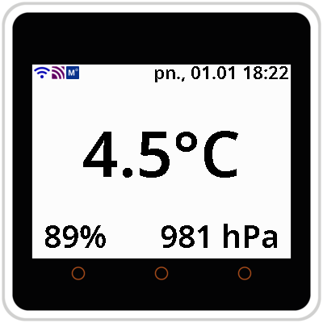
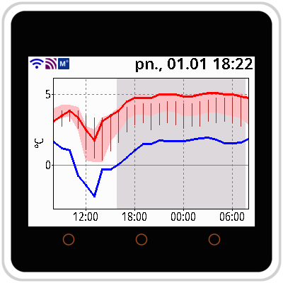
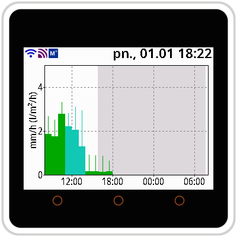
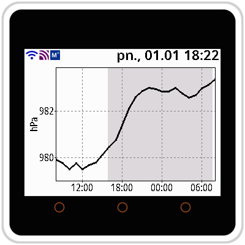

# Weather display for M5Stack Core2

Weather station displaying the latest readings received via MQTT and displaying
numerical [ICM UW][ICMUW] weather forecast.

The software has been written for the [M5Stack Core2][Core2] board, but should
work on other similar boards with little or no adaptation needed.

The main screen displays **temperature**, **humidity**, and **air pressure**
from readings received via MQTT. Forecast plot screens are accessible by
touching the screen.
* Touch the **temperature** area to display the **temperature forecast**:
  (<picture></picture> **mean air temperature**,
  <picture></picture> **min-max air temperature**,
  <picture></picture> **wind chill temperature**, and
  <picture></picture> **surface temperature**).
* Touch the **humidity** area to display the **precipitation forecast**:
  (<picture></picture> **rain**,
  <picture></picture> **snow**, and
  <picture></picture> **rain and snow mixed**).
* Touch the **air pressure** area to display the
  <picture></picture> **air pressure forecast**.

## MQTT messagge format

The application expects the MQTT message be in a JSON object containing
`temperature` in °C, `humidity` in percents, and `pressure` in hPa, as in the
example below. Other fields are ignored.

```JSON
{
  "battery": 83,
  "humidity": 88.52,
  "linkquality": 54,
  "power_outage_count": 1015,
  "pressure": 981.3,
  "temperature": 4.54,
  "voltage": 2975
}
```

## Screenshots

| Main screen                                  |
| :---:                                        |
|  |

| Temperature forecast                         | Precipitation forecast                         | Air pressure forecast                         |
| :---:                                        | :---:                                          | :---:                                         |
|  |  |  |

## Configuration

Create `settings-private.hpp` file that defines:
* `WIFI_SSID` and `WIFI_PASSWORD`,
* `MQTT_SERVER`, `MQTT_TOPIC` plus optionally any of: `MQTT_PORT` (default:
   *1883*), `MQTT_USER` and `MQTT_PASSWORD` (both default to *null*),
   `MQTT_CLIENT_NAME_PREFIX` (default: *M5Stack Core2*),
* `FORECAST_LAT` and `FORECAST_LON` plus optionally `ALTITUDE` (to calculate
   soft min and max of the pressure graph, default: *0*),
* optionally `TZ` in the [POSIX format][TZ] (default: *UTC*),
* optionally `LANG` (default: `LANG_EN`), described below.

Example `settings-private.hpp` configuration file:
```C++
#pragma once

#define WIFI_SSID "YourWiFiSSID"
#define WIFI_PASSWORD "YourWiFiPassword"

#define MQTT_TOPIC "zigbee2mqtt/outside"

#define FORECAST_LAT 52.247308
#define FORECAST_LON 21.013342
#define ALTITUDE 105

#define TZ "CET-1CEST,M3.5.0,M10.5.0/3"
#define LANG LANG_PL
```

### Language support

Poor man's locale support is added for time formatting. The time string is the
local name of the weekday, followed by the time formatted by `strftime` in the
`C` locale. The `Lang` class constructor takes eight c-strings - seven weekday
names and the `strftime` format string for the rest of the format. E.g., Spanish
could be defined as `Lang("dom", "lun", "mar", "mié", "jue", "vie", "sáb", ", %d/%m %H:%M")`.

Two languages are pre-defined in the code: English and Polish.
```C++
#define LANG_EN Lang("", "", "", "", "", "", "", "%a, %b %d %I:%M %p")
#define LANG_PL Lang("nd.", "pn.", "wt.", "śr.", "czw.", "pt.", "sb.", ", %d.%m %H:%M")
```


[ICMUW]: https://www.meteo.pl/
[Core2]: https://docs.m5stack.com/en/core/core2
[TZ]: https://www.gnu.org/software/libc/manual/html_node/TZ-Variable.html
